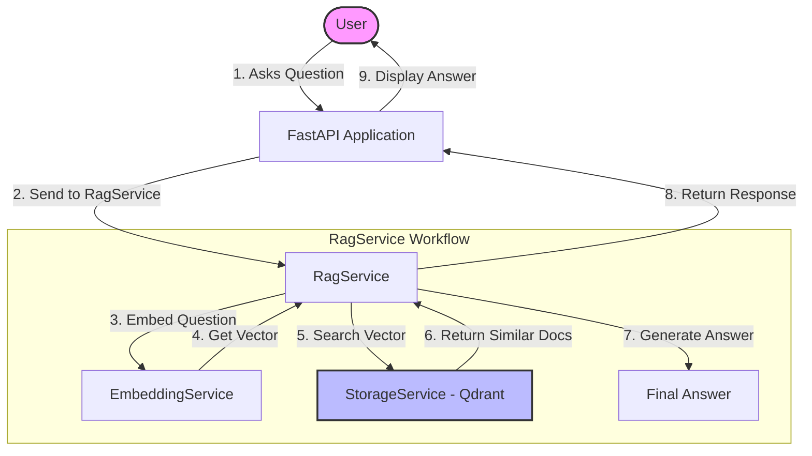

# RAG Demo Project: Code Explanation

Welcome! This document provides a beginner-friendly explanation of the code in this project, focusing on Python concepts, Artificial Intelligence (AI) terms, and the specific architecture used here.

## 1. Project Overview

This is a **Retrieval-Augmented Generation (RAG)** application.

- **Goal:** To answer user questions based on a specific set of documents you provide, rather than just using general knowledge.
- **How it works:**
  1.  **Add Document:** You send text to the app. It converts the text into numbers (vectors) and stores it.
  2.  **Ask Question:** You ask a question. The app searches its storage for relevant text and generates an answer.

## 2. Key AI Concepts

### RAG (Retrieval-Augmented Generation)

RAG combines "retrieval" (finding relevant info) with "generation" (creating an answer). It's like giving an AI a textbook to study before an exam.

### Embeddings

Computers don't understand text; they understand numbers. **Embeddings** are lists of numbers (vectors) that represent the _meaning_ of text.

- _Example:_ "Dog" and "Puppy" will have similar numbers. "Dog" and "Car" will have very different numbers.
- **In this code:** We use a `fake_embed` function in `src/services/embedding_service.py` to simulate this for learning purposes. Real apps use models like OpenAI or HuggingFace.

### Vector Database (Qdrant)

A normal database stores text. A **Vector Database** stores embeddings and allows you to search for _similar meanings_ (e.g., find text closest to "How do I reset my password?").

- **In this code:** We use **Qdrant**. If Qdrant isn't running, the code falls back to a simple Python list (`in-memory`) so the app doesn't crash.

### LangGraph / StateGraph

This is a library for building "stateful" workflows. It defines a series of steps (nodes) the AI should take.

- **Steps in this Demo:** `retrieve` (find info) -> `answer` (formatted response).

## 3. Code Structure Explanation

You will see two main versions of the code:

### A. Legacy Version (`main_legacy.py`)

This is the "All-in-One" approach. Everything is in a single file.

- **Pros:** Easy to write quickly, good for small scripts.
- **Cons:** Hard to manage as the project grows. If you want to change the database, you risk breaking the API.

### B. Professional Version (`src/` directory)

This uses a **Modular Architecture**. The code is split into logical folders:

1.  **`src/controllers/` (and `routes/`)**

    - **Purpose:** The "Front Desk". It receives requests from the user (via HTTP/API) and hands them to the Services.
    - **Example:** `src/main.py` starts the app and points to `src/routes/router.py`.

2.  **`src/services/`**

    - **Purpose:** The "Engine Room". This is where the work happens.
    - - `embedding_service.py`: Handles converting text to numbers.
    - - `storage_service.py`: Handles saving and finding data (talks to Qdrant).
    - - `rag_service.py`: Orchestrates the flow (Get question -> Embed it -> Search -> Answer).

3.  **`src/config/`**
    - **Purpose:** Settings and constants (like database URLs). Keeps "magic values" out of your code.

## 4. Visual Flow: How it Works

Here is a diagram showing how data flows when you ask a question.




## 5. Concept Deep Dive: Embeddings vs. LLMs

Many beginners get these confused. Think of a **Library**:

| Feature          | **Embedding Model**                                                               | **Large Language Model (LLM)**                                       |
| :--------------- | :-------------------------------------------------------------------------------- | :------------------------------------------------------------------- |
| **Role**         | The **Librarian** who organizes the books.                                        | The **Professor** who reads the books and writes an essay.           |
| **Input**        | Text ("The sky is blue")                                                          | Text ("Why is the sky blue?")                                        |
| **Output**       | A list of numbers (Vector) `[0.1, 0.8, -0.3]`                                     | Fluent Text ("The sky appears blue because...")                      |
| **Analogy**      | Converts text into "GPS coordinates" of meaning.                                  | Uses those coordinates to find information and synthesize an answer. |
| **In this code** | `fake_embed` function (Simulating models like `text-embedding-3-small` by OpenAI) | The logic in `simple_answer` (Simulating models like `GPT-4o`)       |

**Core Difference:**

- **Embeddings** are for **FINDING** interactions (Search/Retrieval).
- **LLMs** are for **CREATING** interactions (Chat/Generation).

## 6. Common Alternatives: "The Real World Stack"

This project uses simplified or "fake" tools for learning. Here is what you would use in a real, production company.

| Component     | Used in this Code                    | **Common "Pro" Alternatives**                                                      |
| :------------ | :----------------------------------- | :--------------------------------------------------------------------------------- |
| **Vector DB** | **Qdrant** (Local/Docker)            | **Pinecone** (Cloud-only, very popular), **ChromaDB** (Open Source), **Weaviate**. |
| **Framework** | **LangGraph** (StateGraph)           | **LangChain** (Older, broader), **LlamaIndex** (Great for data).                   |
| **Embedding** | `fake_embed` (Math trick)            | **OpenAI Embeddings**, **HuggingFace** (Free local models).                        |
| **LLM**       | `simple_answer` (String replacement) | **OpenAI (GPT-4o)**, **Anthropic (Claude 3.5)**, **Meta (Llama 3)**.               |

### Why use Pinecone vs Qdrant?

- **Pinecone:** Fully managed service. You don't host it; you just pay and use it. Good if you don't want to manage servers.
- **Qdrant:** Open-source. You can run it on your own laptop (like here) or on your own servers. Good for privacy and keeping costs low if you have hardware.

## 7. Detailed Line-by-Line Code Walkthrough

Here is a breakdown of every line in the core files so you can understand exactly what is happening.

### A. `src/main.py` (The Entry Point)

This file is like the front door of your house. It's where the application starts.

```python
from fastapi import FastAPI                 # 1. Import the FastAPI tool to build web apps.
from .config.config import settings         # 2. Import our settings (like app title) so they aren't hardcoded.
from .routes.router import router           # 3. Import the list of URL paths (routes) we defined elsewhere.

app = FastAPI(title=settings.APP_TITLE)     # 4. Create the actual App object. We name it 'app' and give it a title.

app.include_router(router)                  # 5. Tell the app to use the routes we imported in line 3.
                                            #    Without this, the app wouldn't know any URLs exist.

if __name__ == "__main__":                  # 6. Standard Python check: "Is this file being run directly?"
    import uvicorn                          # 7. Import 'uvicorn', which is the server software that runs FastAPI.
    uvicorn.run(app, host="0.0.0.0", port=8000) # 8. Start the server on port 8000. host="0.0.0.0" means "listen to everyone".
```

### B. `src/services/embedding_service.py` (The Translator)

This service translates text into numbers (vectors).

```python
import random                               # 1. Import Python's random number generator.
from typing import List                     # 2. Import 'List' for type hinting (helps code editors).
from ..config.config import settings        # 3. Import global settings.

class EmbeddingService:                     # 4. Define a class (a blueprint) for this service.
    # Pretend this is a real embedding model
    def fake_embed(self, text: str) -> List[float]:  # 5. Define the function. Takes text, returns a list of floats.
        # Seed based on input so it's "deterministic"
        random.seed(abs(hash(text)) % 10000)         # 6. CRITICAL TRICK: Turn the text into a number (hash) and use it
                                                     #    to set the random seed. This means "Hello" always gives the SAME random numbers.
        return [random.random() for _ in range(settings.EMBEDDING_DIM)] # 7. Generate a list of random numbers.
                                                                        #    Dimensions (128) are defined in settings.
```

### C. `src/services/storage_service.py` (The Librarian)

This service manages where data is stored (Qdrant or Memory).

```python
from typing import List, Optional, Any, Dict        # 1. Imports for type hinting.
from qdrant_client import QdrantClient              # 2. Import the tool to talk to the Qdrant database.
from qdrant_client.models import PointStruct, VectorParams, Distance # 3. Import Qdrant data structures.
from ..config.config import settings                # 4. Import settings.

class StorageService:
    def __init__(self):                             # 5. The "Constructor" - runs when you create this class.
        self._qdrant: Optional[QdrantClient] = None # 6. Place to hold the Qdrant connection. Starts empty (None).
        self.docs_memory: List[str] = []            # 7. Place to hold docs if Qdrant fails (Backup Memory).
        self.USING_QDRANT = False                   # 8. Flag to track if we are using Qdrant or not.
        self._initialize()                          # 9. Run the setup logic immediately.

    def _initialize(self):
        try:                                        # 10. Start a "Try" block. "Try to do this, but if it crashes..."
            self._qdrant = QdrantClient(settings.QDRANT_URL)  # 11. Connect to Qdrant.
            self._qdrant.recreate_collection(       # 12. Create the "bucket" (collection) to store vectors.
                collection_name=settings.COLLECTION_NAME,
                vectors_config=VectorParams(size=settings.EMBEDDING_DIM, distance=Distance.COSINE)
            )
            self.USING_QDRANT = True                # 13. Success! Set flag to True.
        except Exception as e:                      # 14. If anything above failed (crashed)...
            print("⚠️  Qdrant not available...")    # 15. Print a warning.
            self.USING_QDRANT = False               # 16. Set flag to False so we use backup memory.

    def search(self, vector: List[float], query_text: str, limit: int = 2) -> List[str]:
        results = []                                # 17. Create empty list for answers.
        if self.USING_QDRANT:                       # 18. If Qdrant is working...
            hits = self._qdrant.search(             # 19. Ask Qdrant to find similar vectors.
                collection_name=settings.COLLECTION_NAME,
                query_vector=vector,
                limit=limit
            )
            for hit in hits:                        # 20. Loop through the matches found.
                results.append(hit.payload["text"]) # 21. Extract the text and add to results.
        else:                                       # 22. If Qdrant is NOT working (using backup)...
            for doc in self.docs_memory:            # 23. Loop through every doc in memory.
                if query_text.lower() in doc.lower(): # 24. simple text search (not AI). "Is 'dog' in this string?"
                    results.append(doc)

            if not results and self.docs_memory:    # 25. If no match found, but we have docs...
                results = [self.docs_memory[0]]     # 26. Just give the first one (Safety fallback).

        return results                              # 27. Return the list of found texts.
```

### D. `src/services/rag_service.py` (The Conductor)

This service connects everything together using a workflow graph.

```python
from typing import Dict, Any
from langgraph.graph import StateGraph, END         # 1. Import LangGraph tools to build the flowchart.
# ... imports for services ...

class RagService:
    def __init__(self, embedding_service: EmbeddingService, storage_service: StorageService):
        self.embedding_service = embedding_service  # 2. Save the embedding tool to use later.
        self.storage_service = storage_service      # 3. Save the storage tool to use later.
        self.workflow = self._build_workflow()      # 4. Build the AI brain (the graph) immediately.

    def _build_workflow(self):
        workflow = StateGraph(dict)                 # 5. Create a new graph. The "State" is just a Python dictionary.
        workflow.add_node("retrieve", self._retrieve) # 6. Add "retrieve" step (runs self._retrieve function).
        workflow.add_node("answer", self._answer)     # 7. Add "answer" step (runs self._answer function).
        workflow.set_entry_point("retrieve")          # 8. Start at "retrieve".
        workflow.add_edge("retrieve", "answer")       # 9. After "retrieve", go to "answer".
        workflow.add_edge("answer", END)              # 10. After "answer", Stop (END).
        return workflow.compile()                   # 11. "Compile" builds the graph so it's ready to run.

    def _retrieve(self, state: Dict[str, Any]):     # 12. STEP 1: RETRIEVE
        query = state["question"]                   # 13. Get the user's question from the state.
        emb = self.embedding_service.fake_embed(query) # 14. Convert question to vector numbers.
        results = self.storage_service.search(vector=emb, query_text=query) # 15. Search DB for those numbers.
        state["context"] = results                  # 16. Save findings into "state['context']".
        return state                                # 17. Pass state to the next step.

    def _answer(self, state: Dict[str, Any]):       # 18. STEP 2: ANSWER
        ctx = state.get("context", [])              # 19. Get the context we found in Step 1.
        if ctx:                                     # 20. If we found something...
            answer = f"I found this: '{ctx[0][:100]}...'" # 21. Create a simple answer string.
        else:
            answer = "Sorry, I don't know."         # 22. Fallback if nothing found.
        state["answer"] = answer                    # 23. Save answer to state.
        return state                                # 24. Finish.

    def ask(self, question: str) -> Dict[str, Any]: # 25. The Main Public Function.
        result = self.workflow.invoke({"question": question}) # 26. Run the whole graph starting with the question.
        return result                               # 27. Return the final result.
```

## 8. Common Python Tips for Beginners

- **`if __name__ == "__main__":`**: This line in `src/main.py` means "If I run this file directly, do this". It prevents the code from running if you just import it into another file.
- **Type Hinting (`text: str`, `-> List[float]`)**: You'll see colons and arrows in function definitions. These don't change how the code runs, but they help developers (and tools) understand that `text` _should_ be a string and the function _returns_ a list of floats.
- **Decorators (`@app.get`)**: unique to web frameworks like FastAPI. It tells the web server "When a user visits this URL, run this specific function".

---

**Summary:**
You have moved from a simple script (`main_legacy.py`) to a scalable application (`src/`). The complexity (multiple files) is a trade-off for better organization, testing, and longevity.
